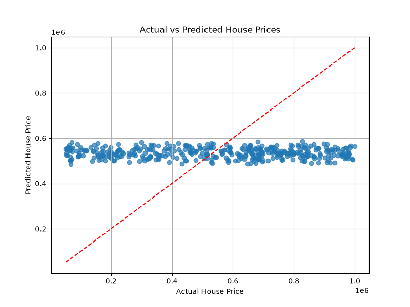

<p align="center">

</p>

<h1 align="center">🏠 House Price Prediction using Machine Learning</h1>

<p align="center">
A Machine Learning Regression Project that predicts house prices using property features such as Area, Bedrooms, Bathrooms, Floors, Year Built, Location, Condition, and Garage.
</p>

<p align="center">


</p>

---

# 📖 Table of Contents

- Project Overview
- Features
- Dataset
- Technologies Used
- Machine Learning Workflow
- Model Evaluation
- Results
- Screenshots
- Project Structure
- Installation
- Future Improvements
- Author
- License

---

# 📌 Project Overview

House Price Prediction is a Machine Learning Regression project that predicts house prices based on different real estate features.

The project follows a complete Machine Learning pipeline including:

- Data Loading
- Data Cleaning
- Label Encoding
- Feature Scaling
- Train-Test Split
- Linear Regression Model
- Price Prediction
- Model Evaluation
- Data Visualization

This project demonstrates how regression algorithms can be applied to solve real-world property price prediction problems.

---

# ✨ Features

- ✅ Data Preprocessing
- ✅ Label Encoding
- ✅ Feature Scaling
- ✅ Linear Regression Model
- ✅ House Price Prediction
- ✅ Model Evaluation (MAE, RMSE & R² Score)
- ✅ Actual vs Predicted Price Visualization
- ✅ Clean & Well-Structured Python Code

---

# 📂 Dataset

Dataset File:

```
House Price Prediction Dataset.csv
```

Dataset contains the following features:

| Feature | Description |
|----------|-------------|
| Id | House ID |
| Area | House Area |
| Bedrooms | Number of Bedrooms |
| Bathrooms | Number of Bathrooms |
| Floors | Number of Floors |
| YearBuilt | Construction Year |
| Location | Property Location |
| Condition | Property Condition |
| Garage | Garage Availability |
| Price | Target Variable |

---

# 🛠 Technologies Used

- Python
- Pandas
- NumPy
- Matplotlib
- Scikit-Learn

---

# 🤖 Machine Learning Workflow

```text
Load Dataset
      │
      ▼
Data Preprocessing
      │
      ▼
Label Encoding
      │
      ▼
Feature Scaling
      │
      ▼
Train-Test Split
      │
      ▼
Linear Regression
      │
      ▼
Prediction
      │
      ▼
Model Evaluation
      │
      ▼
Visualization
```

---

# 📊 Model Evaluation

The model performance is evaluated using the following regression metrics:

- Mean Absolute Error (MAE)
- Root Mean Squared Error (RMSE)
- R² Score

These metrics help determine the prediction accuracy of the model.

---

# 📈 Results

The trained model predicts house prices based on input property features.

The output includes:

- Actual Price
- Predicted Price
- Model Accuracy Metrics
- Scatter Plot Visualization

---

# 🖼 Project Screenshots

## 📊 Prediction Graph

<p align="center">



</p>

---

## 💻 Program Output

> Add your terminal output screenshot below.

<p align="center">

<!-- Paste Terminal Screenshot Here -->

</p>

---

# 📁 Project Structure

```text
House_Price_Prediction_ML
│
├── House Price Prediction Dataset.csv
├── house_price.py
├── requirements.txt
├── House_Price_Prediction_Result.png
├── README.md
└── LICENSE
```

---

# 🚀 Installation

Clone the repository

```bash
git clone https://github.com/Laiba-Wajid/House_Price_Prediction_ML.git
```

Move to the project directory

```bash
cd House_Price_Prediction_ML
```

Install required libraries

```bash
pip install -r requirements.txt
```

Run the project

```bash
python house_price.py
```

---

# 📌 Future Improvements

- Random Forest Regressor
- Gradient Boosting Regressor
- XGBoost Regressor
- Hyperparameter Tuning
- Streamlit Web Application
- Interactive Dashboard
- Model Deployment

---

# 📷 Output Files

After running the project, the following output file is generated:

```
House_Price_Prediction_Result.png
```

---

# 👨‍💻 Author

## Laiba Wajid

**AI/ML Engineering Intern**

### Connect with Me

GitHub:
https://github.com/Laiba-Wajid

LinkedIn:
https://www.linkedin.com/in/laiba-wajid

---

# 📄 License

This project is licensed under the MIT License.

---
